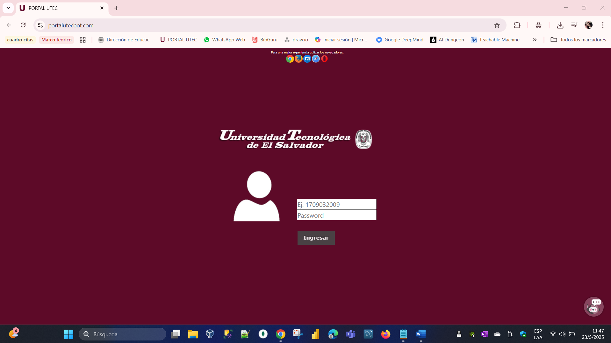
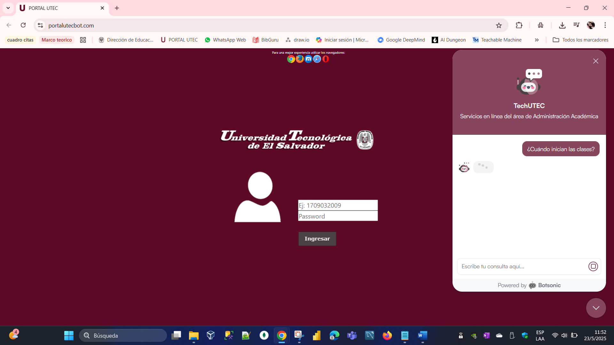

# 📚 Chatbot UTEC

Este proyecto es un chatbot interactivo para responder preguntas frecuentes de los estudiantes de la Universidad Tecnológica de El Salvador (UTEC), basado en Industria 4.0.

## ⚙️ Tecnologías utilizadas

- Botsonic
- HTML/CSS/JS
- Boostrap
- Hostinger

## 🚀 ¿Cómo se usa?

1. Se ingresa a traves del enlace del portal educativo https://portalutecbot.com/
2. En la esquina esta el icono del bot y dar clic para abrir la interfaz
3. realizar la consulta relacionado a temas administrativos academicos de la Universidad

## 📷 Capturas

## 🖼️ Vista del portal

## 🖼️ Vista de la interfaz del chatbot TechUTEC

## 🖼️ Vista del chatbot realizando una consulta y dando una respuesta

## 👩‍💻 Autora

Jasmin Díaz - Estudiante de Ingeniería en Sistemas - UTEC
